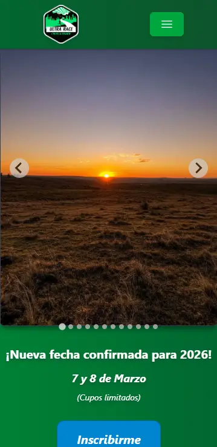
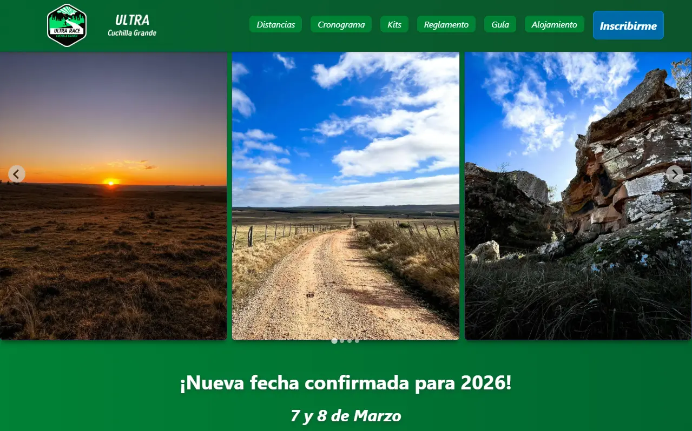

# Ultra Cuchilla Grande

Sitio oficial de **Ultra Cuchilla Grande**, evento de ultramaratón sin fines de lucro creado por corredores para corredores.  
Con distancias de 10, 36, 50 y 100 km, pone al límite la resistencia mental y física de todo participante en Santa Clara de Olimar, Treinta y Tres, Uruguay.

## Demo

[Ver sitio en GitHub Pages](https://brunorealan.github.io/Ultra-Cuchilla-Grande)

## Tecnologías utilizadas

- HTML, CSS, JavaScript
- [Tailwind CSS](https://tailwindcss.com/) (framework de estilos)
- [Splide.js](https://splidejs.com/) (carrusel de imágenes)

## Estructura del proyecto

```plaintext
Ultra-Cuchilla-Grande/
│
├── [index.html](http://_vscodecontentref_/0)
├── [tailwind.config.js](http://_vscodecontentref_/1)
├── [package.json](http://_vscodecontentref_/2)
├── [package-lock.json](http://_vscodecontentref_/3)
├── [README.md](http://_vscodecontentref_/4)
└── src/
    ├── css/
    │   ├── styles-tailwind.css
    │   └── styles.css
    ├── html/
    │   ├── distancias.html
    │   ├── kits.html
    │   ├── reglamento.html
    │   └── cronograma.html
    ├── js/
    │   ├── main.js
    │   ├── carousel.js
    │   └── menu-hamburger.js
    └── resources/
        ├── landscapes-pics/
        ├── runners-pics/
        ├── services-pics/
        ├── logos/
        ├── maps/
        ├── kit-pics/
        └── elevation-maps/
```

## Cómo ejecutar el proyecto

Solo abre `index.html` en tu navegador.  
No requiere instalación ni pasos adicionales.

## Autor

Desarrollado por **Bruno Realán**  
📧 brunorealan@gmail.com  
📱 +598 95914791


## Capturas de pantalla




---

**Ultra Cuchilla Grande**: ¡Poné a prueba tus límites!

